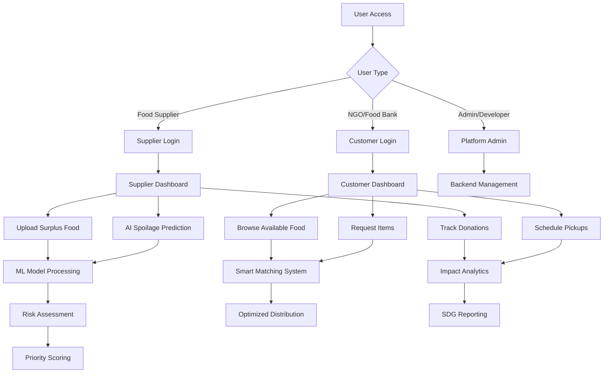
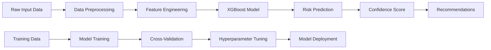

# Surplus2Serve Project Workflow

## 🏗️ **System Architecture Overview**



## 🔄 **Core Workflow Process**

### **Phase 1: User Onboarding**
```
1. Homepage (index_clean.html)
   ↓
2. User selects role (Supplier/Customer/Admin)
   ↓
3. Authentication via Login Pages
   ↓
4. Redirect to appropriate Dashboard
```

### **Phase 2: Supplier Workflow**
```
Supplier Dashboard → Upload Inventory → AI Analysis → Distribution
                  ↓                    ↓             ↓
              Profile Mgmt    Spoilage Prediction  Impact Tracking
```

### **Phase 3: Customer (NGO) Workflow**
```
Customer Dashboard → Browse Products → Request Items → Schedule Pickup
                  ↓                  ↓               ↓
              Profile Mgmt      Smart Filtering   Delivery Coordination
```

### **Phase 4: AI/ML Processing**
```
Input Data → ML Model (XGBoost) → Risk Score → Recommendations
    ↓              ↓                   ↓             ↓
Storage Conditions  Feature Engineering  Priority Level  Action Items
```

## 📂 **File Structure & Data Flow**

### **Frontend Components**
```
index_clean.html (Homepage)
    ├── Quick Access Portal
    ├── AI Demo Section
    ├── Impact Metrics
    └── Contact Forms

Login Pages/
    ├── Supplier Login → Firebase Auth → Supplier Dashboard
    └── Customer Login → Firebase Auth → Customer Dashboard

Dashboards/
    ├── Supplier Dashboard/
    │   ├── index.html (Main Interface)
    │   ├── style.css (Styling)
    │   └── script_new.js (Functionality)
    └── Customer Dashboard/
        ├── index.html (Main Interface)
        ├── style.css (Styling)
        └── script.js (Functionality)
```

### **Backend Components**
```
backend/
    ├── main.py (FastAPI Server)
    ├── models.py (ML Model Loading)
    ├── database.py (Data Management)
    ├── utils.py (Helper Functions)
    └── requirements.txt (Dependencies)

Model/
    ├── v5_complete.ipynb (ML Development)
    ├── enhanced_spoilage_model.ipynb (Model Training)
    ├── best_spoilage_model_with_xgboost.pkl (Trained Model)
    └── large_enhanced_produce_spoilage_dataset.csv (Training Data)
```

## 🤖 **AI/ML Workflow**

### **Data Processing Pipeline**


### **Prediction Features**
- **Environmental**: Temperature, Humidity, Storage Type
- **Temporal**: Days Since Harvest, Transport Duration, Month
- **Quality**: Packaging Quality, Commodity Type
- **Output**: Risk Score (Low/Medium/High), Shelf Life Prediction

## 🌐 **API Integration**

### **Endpoint Structure**
```
Backend API (localhost:8000)
    ├── /predict_spoilage (POST)
    ├── /health (GET)
    ├── /retrain_model (POST)
    └── /get_statistics (GET)

Frontend Integration
    ├── main-integration.js (API Client)
    ├── Fallback Demo Mode
    └── Real-time Predictions
```

## 📊 **Data Flow Architecture**

### **Information Flow**
```
User Input → Frontend Validation → API Request → ML Processing → Database Update → Response → UI Update
    ↓              ↓                    ↓             ↓               ↓              ↓         ↓
Form Data    Client Validation    JSON Payload   Risk Analysis   Data Storage   JSON Result  Display
```

### **Database Schema** (Conceptual)
```
Users Table
    ├── user_id, email, role, created_at
    
Inventory Table
    ├── item_id, supplier_id, commodity, quantity, location
    
Predictions Table
    ├── prediction_id, item_id, risk_score, timestamp
    
Transactions Table
    ├── transaction_id, supplier_id, customer_id, status
```

## 🎯 **Business Logic Workflow**

### **Smart Matching Algorithm**
```
1. Supplier uploads surplus food
2. AI predicts spoilage risk
3. System prioritizes high-risk items
4. Location-based matching with NGOs
5. Automated notifications sent
6. Pickup scheduling coordinated
7. Impact metrics updated
```

### **Impact Tracking**
```
Food Donated → Weight Calculated → CO2 Savings → People Fed → SDG Metrics
     ↓              ↓                   ↓            ↓           ↓
   Database      Environmental       Social      Reporting   UN Goals
   Storage       Impact Calc        Impact       Dashboard   Tracking
```

## 🚀 **Deployment Workflow**

### **Development Environment**
```
Local Development
    ├── Python Backend (FastAPI)
    ├── HTML/CSS/JS Frontend
    ├── ML Model (Jupyter Notebooks)
    └── Batch Scripts for Automation
```

### **Production Setup** (Recommended)
```
Cloud Deployment
    ├── Backend: Docker + Cloud Run/Heroku
    ├── Frontend: Static Hosting (Netlify/Vercel)
    ├── Database: PostgreSQL/MongoDB
    ├── ML Models: Cloud Storage + API
    └── CDN: Asset Delivery
```

## 🔧 **Development Commands**

### **Quick Start Sequence**
```bash
# 1. Start Backend
cd backend
python main.py

# 2. Start Frontend
# Open index_clean.html in browser

# 3. Test ML Model
cd Model
jupyter notebook enhanced_spoilage_model.ipynb

# 4. Integration Testing
python backend/test_api.py
```

### **Model Training Pipeline**
```bash
# 1. Data Generation
python generate_dataset.py

# 2. Model Training
jupyter notebook v5_complete.ipynb

# 3. Model Export
python export_model.py

# 4. API Integration
python test_integration.py
```

## 📈 **Success Metrics**

### **Technical KPIs**
- Model Accuracy: >85%
- API Response Time: <2 seconds
- System Uptime: >99%
- User Satisfaction: >4.5/5

### **Business KPIs**
- Food Waste Reduction: 85%
- Active Suppliers: 2,500+
- Partner NGOs: 1,200+
- People Fed: 1.2M+

## 🛡️ **Security & Compliance**

### **Data Protection**
```
User Authentication → Firebase Auth
Data Encryption → HTTPS/TLS
Privacy Compliance → GDPR/Local Laws
Access Control → Role-Based Permissions
```

### **Quality Assurance**
```
Code Testing → Unit Tests
Integration Testing → API Tests
Performance Testing → Load Tests
Security Testing → Vulnerability Scans
```

---

## 🎨 **Visual Summary**

This project follows a **microservices architecture** with:
- **Frontend**: Modern responsive web interfaces
- **Backend**: Python FastAPI with ML integration
- **AI/ML**: XGBoost-based prediction models
- **Data**: CSV-based training with real-time processing
- **Integration**: RESTful APIs with fallback mechanisms

The workflow emphasizes **user experience**, **AI-driven insights**, and **social impact measurement** while maintaining **scalability** and **reliability**.
